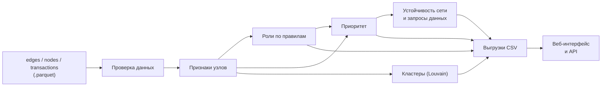
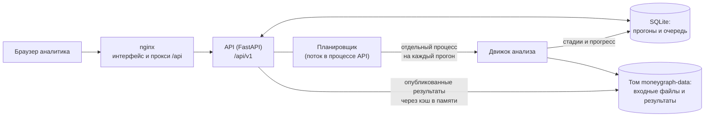
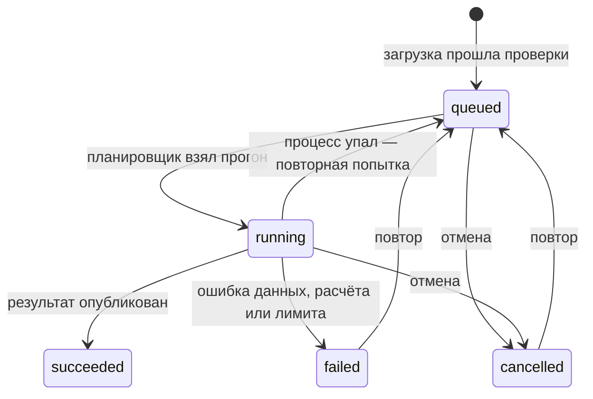

# Как это работает

Из трёх parquet-файлов с переводами система строит **направленный граф денег**. Для каждого из 2 248 клиентов
она считает признаки, присваивает роль по явным правилам с числовым обоснованием, ранжирует узлы по приоритету
проверки и показывает результат аналитику в веб-приложении.

> Все выводы — **гипотезы для проверки** («признаки консолидации», «рекомендуется проверить»), а не
> утверждения о виновности. Данные обезличены; атрибуты клиентов не используются и не достраиваются.

**Содержание:** [1. Как запустить](#1-как-запустить) ·
[2. Путь данных](#2-путь-данных) · [3. Входные данные](#3-входные-данные-и-почему-важна-их-форма) ·
[4. Признаки](#4-от-переводов-к-признакам) · [5. Роли](#5-роли) · [6. Приоритет](#6-приоритет) ·
[7. Кластеры, устойчивость, запросы данных](#7-кластеры-устойчивость-запросы-данных) ·
[8. Выгрузки](#8-выгрузки) · [9. Веб-продукт](#9-веб-продукт-как-устроен) ·
[10. Жизненный цикл прогона](#10-жизненный-цикл-прогона) · [11. Интерфейс](#11-работа-аналитика-в-интерфейсе) ·
[12. Ассистент](#12-ассистент) · [13. Безопасность](#13-безопасность-и-надёжность) ·
[14. Проверка](#14-как-проверяли-что-это-работает) · [15. Ограничения](#15-ограничения) ·
[16. Подробнее](#16-где-подробнее)

## 1. Как запустить

Дважды щёлкните файл для своей системы: `start-windows.bat`, `start-macos.command` или `start-linux.sh`. Нужен только
Docker. Скрипт поднимает приложение, ждёт окончания анализа данных кейса, сохраняет выгрузки в `results/` и открывает
результат в браузере. Подробности и решение проблем — в [LAUNCH.md](LAUNCH.md).

Вручную: `cd app && cp .env.example .env && docker compose up --build`, затем http://localhost:8080. При первом старте
приложение само создаёт прогон на данных кейса из `app/backend/sample_data/`. Метод реализован в движке
`app/backend/src/moneygraph`; веб-приложение запускает его для каждого прогона.

## 2. Путь данных

Расчёт детерминирован: фиксированные seed, стабильные сортировки и закреплённые версии библиотек. Два прогона
на одних данных дают побайтно одинаковые CSV. Полный пересчёт данных кейса занимает около 6–8 секунд.

## 3. Входные данные и почему важна их «форма»

Три таблицы:
- `nodes.parquet` — клиенты: `gid`, колено обхода `depth`, признак `is_seed`;
- `edges.parquet` — пары «плательщик → получатель» с суммой и числом операций за период;
- `transactions.parquet` — отдельные переводы с датами.

Выгрузку собирали так: от 81 известного клиента (seed) по **исходящим** переводам на 4 колена, только переводы
от 5 000 ₸ за июль 2026. Получилось 2 248 узлов, 3 119 рёбер и 4 840 транзакций. Из способа сбора следуют
правила, без которых роли получаются неверными:

| Свойство выгрузки | Что это значит для метода |
|---|---|
| У колен 0–3 исходящие собраны полностью | если такой узел не отдал деньги дальше, они действительно остались у него |
| У 4-го колена исходящих нет, потому что обход остановился | такие узлы **никогда** не считаются конечными получателями; для них оценивается, продолжают ли они цепочку |
| Деньги, пришедшие к seed извне, в выгрузку не попали | для seed не используется отношение «отдал / получил» |
| Переводы меньше 5 000 ₸, наличные и межбанк не видны | дробление ловится только видимое, и это прямо оговаривается |
| Даты без времени | порядок операций внутри дня условен; выводы по датам означают совместимость, а не доказанный путь денег |

Перед расчётом данные проверяются: колонки и типы, уникальность клиентов, положительные суммы, распознаваемые
даты. Главное — суммы и число операций в `edges` должны совпадать с `transactions`. Если проверка не прошла,
ошибка указывает поле, например `transactions.sum_kzt`.

## 4. От переводов к признакам

Для каждого узла считается набор признаков. Полный список есть в выгрузке `features.csv`, описание каждого — в
[README](README.md#2-признаки-узла-featurescsv). Главные идеи:

**Потоки.** Сколько узел получил и отдал, от скольких разных плательщиков и скольким получателям, сколько было
операций. Сумма и частота — разные сигналы: один перевод на 4 млн ₸ и сорок переводов по 100 тыс ₸ дают
одинаковый оборот, но означают разное поведение.

**Трассировка денег seed.** Главный вопрос — могли ли до узла дойти деньги известных клиентов. Переводы
обрабатываются по порядку дат. У каждого узла есть видимый остаток и «пул» денег с метками seed. Каждый исходящий
перевод уносит долю пула, пропорциональную своей доле в остатке. Если узел отправил больше, чем получил, разница
считается внешними деньгами без метки. В итоге для каждого узла известно, сколько тенге входа могло прийти от
seed и от скольких разных seed.

> Деньги не «текут назад во времени». Если курьер 3 июля перевёл получателю 10 000 ₸, а сам получил деньги
> seed только 5 июля, получателю эти деньги не приписываются: 3 июля их у курьера ещё не было.

**Контроль.** Какие узлы перестанут быть достижимы от seed, если заблокировать данный узел? Для ответа строится
дерево доминаторов от виртуального корня, соединённого со всеми seed. Узел, через который проходят все пути к
большому поддереву, — узкое место сети.

**Время.** Входящие и исходящие переводы сопоставляются по датам по принципу FIFO: какая доля суммы ушла
в течение 0–2 дней после поступлений и какая — строго через 1–2 дня. Так настоящий транзит отличается от
случайного совпадения сумм. Ещё считаются синхронные поступления (много плательщиков в один день), всплески
активности и дробление.

**Маршруты и возвраты.** Повторяющиеся цепочки «A → узел → C» на разных датах и циклы из 2–3 звеньев,
замкнувшиеся по датам не дольше чем за 7 дней.

**Посредничество и аномалии.** Центральность посредничества считается внутри своей компоненты; длина ребра равна
1/сумма, чтобы крупные денежные каналы считались «короткими». Аномальность оценивается робастным z-score
относительно узлов того же колена.

**Модель обрыва.** Для 444 узлов 4-го колена неизвестно, отправляли ли они деньги дальше. Логистическая
регрессия обучается на коленах 1–3, где ответ известен, и по профилю входящих переводов оценивает
`p_continue`. Качество показано честно: AUC 0.75 на кросс-валидации и 0.66 при переносе на новое колено.
Поэтому `p_continue` задаёт очерёдность дозагрузки, а не вероятность.

## 5. Роли

Правила проверяются по порядку; роль задаёт первое сработавшее.

| # | Роль | Суть правила |
|---|---|---|
| 1 | Координатор | колено ≤ 3; узел и собирает, и распределяет (≥ 5 плательщиков и ≥ 10 получателей) либо собирает деньги нескольких seed и выплачивает seed; при этом он связующее звено: деньги ≥ 2 seed, высокое посредничество или контрагенты из ≥ 3 кластеров |
| 2 | Точка консолидации | ≥ 5 разных плательщиков (или ≥ 3, через которых сходятся деньги ≥ 3 seed), и деньги накапливаются, а не расходятся веером |
| 3 | Распределитель | ≥ 10 получателей, и их хотя бы вдвое больше, чем плательщиков |
| 4 | Транзит | не seed, колено ≤ 3; отдал 50–150 % полученного, и пересылка подтверждена датами: ≥ 50 % суммы ушло за 0–2 дня, ≥ 25 % — строго через 1–2 дня |
| 5 | Конечный получатель | колено ≤ 3, отдал дальше не больше 20 %, после последнего поступления узел наблюдали не меньше 7 дней |
| 6 | Периферия | всё остальное: обрыв на 4-м колене, «похоже на транзит, но без подтверждения датами», сбор без накопления, поступления в последние дни периода |

Точные пороги и формулы — в [README](README.md#3-правила-ролей), а сами числа собраны в
`app/backend/src/moneygraph/config.py`.
К каждой роли прилагаются:
- `role_score` от 0 до 1 — насколько сильно данные поддерживают правило (это не вероятность вины);
- `evidence` — короткое обоснование с числами, например «8 плательщиков (2 из них seed)… отдал дальше 24 %»;
- флаги — дополнительные сигналы: `external_funds`, `fast_transit`, `sync_inflow`, `structuring`,
  `likely_continues`, `short_followup` и другие;
- истинность каждого правила (`rule_*` в `features.csv`), чтобы любой узел можно было проверить вручную.

## 6. Приоритет

«Кого смотреть первым» считается так: `priority_score = Σ вес × компонента × надёжность`. Каждая компонента
лежит в диапазоне [0, 1]:

| Компонента | Вес | Что измеряет |
|---|---|---|
| деньги seed | 0.15 | сколько входа узла связано с деньгами seed |
| сходимость | 0.15 | деньги скольких разных seed дошли до узла |
| контроль | 0.15 | сколько узлов отрезает от seed его блокировка |
| роль | 0.15 | вес роли × сила правила |
| сбор | 0.10 | число разных плательщиков |
| оборот | 0.10 | вход и выход вместе |
| посредничество | 0.10 | центральность посредничества |
| флаги | 0.10 | число красных флагов |

Надёжность: seed × 0.85 (они уже известны, поэтому внимание смещается на новых участников), 4-е колено × 0.75,
узел без переводов × 0. Поле `why` называет три компоненты с наибольшим вкладом и следующий шаг проверки.
В карточке узла вклад каждой компоненты виден отдельно; их сумма, умноженная на надёжность, равна приоритету.

**Пример «за минуту».** `100000003115284100` — точка консолидации, приоритет № 1. У него 8 разных плательщиков
(2 из них seed); из 2,16 млн ₸ входа дальше ушло только 24 %, и всего двум получателям. По трассировке 815 тыс ₸
входа (38 %) связаны с тремя разными seed; до 7 плательщиков платили в один день. Сработало правило 2:
≥ 5 плательщиков и 2 получателя ≤ max(2, 8/3). Основной вклад в приоритет дали роль (+0.14), деньги seed (+0.12)
и сходимость (+0.11).

## 7. Кластеры, устойчивость, запросы данных

**Кластеры.** Louvain работает на ненаправленной проекции графа: встречные суммы складываются, `seed=42`.
Направление теряется только на этом шаге; роли и приоритет считаются на направленном графе. Гипотеза назначения
кластера строится по его составу: «контур сбора», «контур распределения», «ветка одного seed», «окружение без
seed». Если в обрыве не меньше 30 % узлов кластера, добавляется пометка «нужна дозагрузка». Кластер 0 — seed
без переводов.

**Устойчивость.** Проверка того, что приоритет выделяет действительно важные узлы: из графа убирают топ-N узлов
по приоритету и, для сравнения, N случайных узлов. Блокировка 20 приоритетных узлов отрезает около трети
оборота, достижимого от seed; блокировка 20 случайных — около 2 %.

**Запросы данных.** Где выгрузка неполна и что запросить следующим: исходящие переводы узлов 4-го колена
с высоким `p_continue`, август для узлов с коротким периодом наблюдения, данные других банков и наличные для
seed и узлов с внешними средствами.

## 8. Выгрузки

После запуска в один клик файлы лежат в папке `results/`; в интерфейсе их можно скачать кнопкой «↓ Экспорт».

| Файл | Что внутри |
|---|---|
| `nodes_roles.csv` | 2 248 строк: `gid, role, role_score, cluster_id, priority_score, evidence` + `flags, depth, is_seed, priority_rank` |
| `clusters.csv` | строка на кластер: состав, суммы, ключевые узлы, гипотеза назначения |
| `top_nodes.csv` | топ-50: `rank, gid, role, priority_score, why` |
| `features.csv` | все признаки, истинность правил `rule_*`, компоненты приоритета `p_*` |
| `resilience.csv` | устойчивость сети: топ-N против случайных N |
| `data_requests.csv` | какие данные запросить и по каким узлам |
| `run_report.md` | сводка прогона |

В конце прогона схема проверяется автоматически: 2 248 уникальных gid, все поля заполнены, скоры в [0, 1],
`evidence` не длиннее 200 символов и содержит числа.

## 9. Веб-продукт: как устроен

- **Интерфейс** — React и TypeScript, граф рисуется через WebGL (sigma.js). Состояние экрана хранится в URL,
  поэтому ссылку на конкретный узел можно переслать коллеге.
- **nginx** отдаёт интерфейс, проксирует `/api`, ставит заголовки безопасности (в том числе строгую CSP) и
  передаёт загрузки на backend потоком.
- **API** — версионированный REST под `/api/v1` с единым форматом ошибок. Контракт описан в
  [`app/docs/API.md`](app/docs/API.md).
- **Планировщик** — поток внутри процесса API. Он берёт прогоны из очереди в SQLite и запускает каждый
  в отдельном процессе, чтобы тяжёлый расчёт не мешал API.
- **Движок** — метод из разделов 3–7. Для скачивания он пишет CSV, а для API — компактные parquet и json.
- **Хранилище** — Docker-том `moneygraph-data` с базой SQLite и папками прогонов.

## 10. Жизненный цикл прогона

1. **Загрузка.** Принимается один zip или три parquet-файла. Вход и размер проверяются ещё до чтения тела
   запроса. Архив распаковывается с защитой от подмены путей и «zip-бомб». Затем читаются только метаданные
   parquet: колонки, типы, число строк, оценка объёма в памяти. Слишком большой или некорректный файл отклоняется
   сразу, с указанием поля. Только после этого прогон ставится в очередь.
2. **Расчёт.** Планировщик запускает отдельный процесс; полная проверка данных и анализ идут там. Интерфейс
   показывает стадии и прогресс: «Проверка входных данных» → «Признаки» → «Роли и приоритеты» → «Кластеры
   и выгрузки» → «Устойчивость сети и запросы данных» → «Запись результатов».
3. **Публикация.** Результат пишется в отдельную папку попытки. Опубликован он становится атомарно, переключением
   ссылки `current`, в той же транзакции, которая отмечает успех. Поэтому никто не видит наполовину записанный
   результат.
4. **Сбои.** У каждой попытки свой токен: «потерявшийся» процесс не может записать результат поверх новой попытки.
   Упавший процесс перезапускается до `MG_MAX_ATTEMPTS` раз, зависший останавливается по таймауту, а отмена
   побеждает и успех, и ошибку. Ошибку в данных повтор не исправит, поэтому интерфейс предлагает загрузить
   исправленную выгрузку.
5. **Память.** У каждого прогона есть бюджет `MG_RUN_MEMORY_MB`: прогон, превысивший его, останавливается с
   собственной ошибкой. Жёсткий предел всего контейнера — `MG_BACKEND_MEMORY`. При его превышении ядро
   в первую очередь останавливает процесс прогона, но API расходует тот же предел, поэтому гарантии для API нет.

## 11. Работа аналитика в интерфейсе

1. **Вход.** Если задан `MG_API_TOKEN`, интерфейс один раз спрашивает токен и дальше держит сессию
   в HttpOnly-cookie.
2. **Исследования.** Список прогонов со статусами, загрузка новой выгрузки и кнопка «Запустить на демо-данных».
   При загрузке можно задать параметры сбора: окно наблюдения, глубину обхода, порог суммы. Если параметры
   не заданы, они выводятся из данных, и прогон показывает предупреждение.
3. **Рабочее пространство прогона:**
   - слева — **Приоритеты** (топ-лист с блоком «Почему проверить») и **Кластеры**, поиск по части gid от 3 цифр;
   - в центре — **Граф связей**: размер узла показывает приоритет, цвет — роль или кластер, стрелки —
     направление денег. Есть фильтры по ролям, кластеру, минимальному приоритету, «без периферии» и
     переключение в таблицу;
   - справа — **Карточка клиента**: роль и скоры, основание гипотезы, метрики, вклад компонент приоритета,
     сработавшие правила, контрагенты и транзакции. Кнопки **«← Откуда деньги»** и **«Куда ушли →»** подсвечивают
     цепочки; ещё можно показать окружение узла и **путь к другому клиенту**;
   - вкладки **Обзор** (гипотезы ролей, устойчивость сети, модель продолжения переводов, ограничения),
     **Клиенты** (таблица с сортировкой и фильтрами) и **Запросы данных**.
4. **Экспорт** — любой CSV или всё одним архивом.
5. **Методология** — правила ролей, веса приоритета и ограничения прямо в интерфейсе.

Граф целиком не пересылается: сервер отдаёт ограниченные подграфы (сначала узлы с высоким приоритетом) и честно
сообщает об усечении, а нужные узлы подгружаются по запросу.

## 12. Ассистент

Вопросы задаются на русском. В ответе есть ссылки на клиентов, подсветка на графе и кнопка «Показать на графе».

- **Офлайн-режим** работает по умолчанию, данные не покидают сервер. Он понимает шаблоны:
  - «кто собирает деньги с A, B, C» — общие узлы ниже по потоку, не дальше 4 переходов;
  - «путь от A к B», «откуда деньги у X», «куда ушли деньги X»;
  - «кластер X», «топ 5 консолидаторов», «почему X».

  gid можно указать целиком или уникальным фрагментом от 6 цифр. Если фрагмент подходит к нескольким клиентам,
  ассистент предложит варианты.
- **LLM-режим** (Claude) включается только явно: `MG_LLM_ENABLED=true` и ключ API. Модель отвечает, вызывая те же
  операции над графом как инструменты: поиск, карточка, трассировка, путь, общие получатели, топ, кластер.
  Параметры каждого вызова строго проверяются. В режиме «Автоматически» при недоступности модели ассистент
  отвечает офлайн.

## 13. Безопасность и надёжность

- **Доступ.** Токен `MG_API_TOKEN` меняется на подписанную HttpOnly-cookie (SameSite=Strict); скрипты передают
  `Authorization: Bearer`. Число попыток входа ограничено.
- **Загрузки.** Вход и размер проверяются до разбора тела запроса. Ограничены размер, число файлов в архиве,
  число строк, объём данных в памяти и размер трассировки.
- **Ошибки.** Все ошибки приходят в едином конверте `{"error": {code, message, request_id, details, retryable}}`
  с сообщением на русском. Тот же `request_id` есть в заголовке `X-Request-ID` и в JSON-логах сервера.
- **Интерфейс.** Строгая CSP; ответы сервера выводятся как текст, без вставки HTML.
- **Данные** не покидают сервер, пока явно не включён LLM-режим.
- **Мониторинг.** `/api/v1/health` показывает, жив ли процесс, `/api/v1/ready` — готовы ли база, диск
  и планировщик.

## 14. Как проверяли, что это работает

- **Два независимых решения.** Claude и Codex сначала написали пайплайны независимо друг от друга. Затем их
  сравнили: совпадение ролей, кластеров, топа. Итог собран из сильных сторон обоих, после чего Codex провёл
  состязательное ревью.
- **Тесты движка.** Специально собранный набор, в котором роль каждого узла известна заранее, и отдельная
  проверка того, что деньги нельзя протрассировать назад во времени.
- **Детерминизм.** Выгрузки побайтно совпадают между прогонами и до и после рефакторинга.
- **Тесты продукта.** 128 тестов backend (API, авторизация, загрузки, жизненный цикл прогонов, конкурентные
  сценарии очереди и кэша), 61 тест интерфейса и 4 браузерных сценария.
- **Живой прогон** всего стека в Docker через браузер: вход, прогоны, граф, карточки, ассистент, ошибки данных,
  отмена — без ошибок в консоли и в API.
- **Независимое ревью backend.** Codex нашёл 15 проблем; все исправлены, а повторные проверки продолжались, пока
  рецензент не подтвердил исправления. Ход работы описан в [`app/docs/COLLABORATION.md`](app/docs/COLLABORATION.md).

## 15. Ограничения

- Роли — гипотезы по структуре и суммам. Назначений платежей, остатков на счетах и атрибутов клиентов в данных нет.
- Видны только внутрибанковские переводы от 5 000 ₸ за июль. Наличные, межбанк и дробление ниже порога не видны.
- Даты без времени, поэтому трассировка и маршруты показывают совместимость по датам и суммам, а не доказанное
  движение одних и тех же денег.
- Пороги экспертные и не откалиброваны на размеченных данных (их нет). Все пороги собраны в `config.py`.
- Модель обрыва при переносе на 4-е колено занижает долю продолжений; её выход — очерёдность дозагрузки.
- Высокий приоритет может дать структура (мост, узкое место) при слабой связи с деньгами seed. Поэтому
  в карточке виден вклад каждой компоненты.

## 16. Где подробнее

- [`README.md`](README.md) — решение кейса: все признаки, точные пороги ролей, формула приоритета, разбор узлов,
  масштабирование до ~1 млн узлов.
- [`LAUNCH.md`](LAUNCH.md) — запуск в один клик на Windows, macOS и Linux, решение проблем.
- [`app/README.md`](app/README.md) — ручной запуск, настройки и эксплуатация продукта.
- [`app/docs/ARCHITECTURE.md`](app/docs/ARCHITECTURE.md) — архитектура, границы модулей, жизненный цикл, инварианты.
- [`app/docs/API.md`](app/docs/API.md) — контракт API.
- [`app/docs/COLLABORATION.md`](app/docs/COLLABORATION.md) — как Claude и Codex проектировали и проверяли друг друга.
