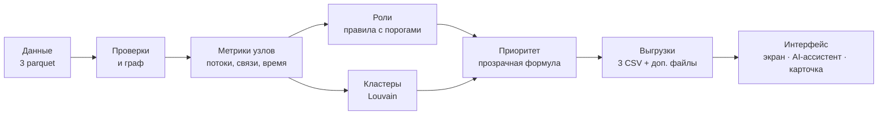

# Граф денег — HackAlem AI (команда A-lN)

Инструмент для AML-аналитика. Он восстанавливает структуру финансовой сети по графу банковских
переводов и отвечает на главный вопрос кейса:
**«кого из 2 248 клиентов проверять первым и почему»**.

Полный пересчёт на ноутбуке занимает около 10 секунд одной командой. Технические подробности
(формулы, алгоритмы, схемы данных, проверка качества) вынесены в [TECH_DETAILS.md](TECH_DETAILS.md).
Этот файл описывает проект целиком без погружения в них.

---

## 1. Что требовалось

### Проблема

AML-аналитик банка получает от правоохранительных органов список из 81 клиента, связанных с
незаконным оборотом наркотиков. Это нижний уровень цепочки, «курьеры». Кто собирает их деньги,
через кого их прогоняют и кто ими распоряжается, приходится восстанавливать вручную: на один узел
уходят часы, большая часть сети остаётся невидимой, а решение, кого проверять первым, принимается
интуитивно.

### Данные

Банк выгрузил **исходящие** переводы этих 81 клиента (seed) и дальше по цепочке **на 4 колена**:
кому они платили, кому платили те и так далее.

| | |
|---|---|
| Период | июль 2026 |
| Переводы | только внутрибанковские, от 5 000 ₸ |
| Объём | 2 248 клиентов, 3 119 связей «плательщик → получатель», 4 840 переводов, 365,9 млн ₸ |
| Атрибуты клиентов | нет: данные обезличены, есть только структура переводов и суммы |
| Файлы | 3 parquet в `data/` (`nodes`, `edges`, `transactions`) |

### Что нужно было построить

Инструмент, который по графу:

1. присваивает **каждому** из 2 248 узлов роль, уверенность в ней (0–1) и понятное обоснование с
   числами (например, «получает от 11 разных плательщиков, отдаёт дальше 3% полученного»).
   Роли из словаря ТЗ:

   | Роль | Смысл |
   |---|---|
   | консолидатор | аккумулирует средства от нескольких участников |
   | транзит | пропускает деньги дальше, не удерживая |
   | распределитель | веерно раздаёт средства многим получателям |
   | конечный получатель | деньги приходят и остаются |
   | координатор | координирующий узел, кандидат в организаторы |
   | периферия | признаков роли не выявлено |

2. разбивает сеть на **кластеры** и выдвигает гипотезу о назначении каждого;
3. ранжирует узлы по **приоритету проверки** (топ-лист не короче 20 узлов с обоснованием);
4. показывает **схему сети**: направление потоков, подсветка ролей и кластеров, поиск по gid.

### Обязательные требования и ограничения

- Воспроизводимость: одна команда от сырых parquet до трёх выгрузок, не дольше 5 минут, локально.
- Выгрузки фиксированной схемы, которую жюри проверяет механически: `nodes_roles.csv` (ровно 2 248
  строк), `clusters.csv`, `top_nodes.csv`.
- Объяснимость: жюри называет любой gid, и команда за минуту объясняет его роль по своим метрикам.
  «Чёрный ящик» не засчитывается.
- Нельзя захардкодить ответы, обогащать данные внешними источниками или требовать облако, GPU или
  платные сервисы.
- Выводы формулируются как **гипотезы для проверки** («признаки консолидации»), а не как
  утверждения о виновности.
- Организаторы заранее назвали ловушки данных: обрыв обхода на 4-м колене, заниженные входящие у
  seed, разница между суммой и числом переводов, направленность графа.

---

## 2. Что мы сделали



Слайд со схемой: [`docs/solution_diagram.svg`](docs/solution_diagram.svg).

Коротко:

- **Роли назначаются формальными правилами с порогами**, без обучаемой модели. У каждого узла
  записано, какое правило сработало (`rule_fired`), и есть обоснование с числами (`evidence`).
- **Ловушки данных учтены явно.** Узлы 4-го колена никогда не называются «конечными» без оговорки,
  входящий баланс seed не используется для решений, сумма и число переводов учитываются вместе.
- **Приоритет — сумма пяти понятных слагаемых**: роль, оборот, центральность, связь с seed,
  подозрительные сигналы. Каждое слагаемое видно отдельно.
- **Экран просмотра** — один HTML-файл без интернета: вся сеть сразу, очередь проверки, карточка
  клиента, подсветка цепочек «откуда пришли / куда ушли деньги».
- **AI-ассистент** отвечает на вопросы аналитика по графу. Он опирается только на наши расчёты и
  ссылается на конкретные gid.
- **Сверх обязательного:** временные паттерны, повторяющиеся маршруты и циклы, аномалии, оценка
  устойчивости сети, список данных, которые стоит запросить дальше.

---

## 3. Как запустить

Нужен только [uv](https://docs.astral.sh/uv/): Python 3.12 и все зависимости он поставит сам.

```bash
uv sync                  # один раз: окружение и зависимости
uv run moneygraph        # полный пересчёт: data/*.parquet → out/  (~10 секунд)
```

| Что | Команда |
|---|---|
| Экран просмотра | открыть `out/viewer.html` двойным кликом (работает офлайн) |
| Экран + AI-ассистент | `uv run moneygraph serve` → <http://127.0.0.1:8765> |
| Карточка узла в терминале | `uv run moneygraph explain 8165763100` (полный gid или его последние цифры) |
| Проверка выгрузок | `uv run pytest` |

Для AI-ассистента скопируйте `.env.example` в `.env` и впишите `OPENAI_API_KEY`. Файл `.env` в
репозиторий не попадает. Без ключа всё остальное работает, а ассистент просто показывает карточки
узлов.

---

## 4. Что получается на выходе

Все файлы пишутся в `out/` и лежат в репозитории, поэтому результат можно посмотреть без запуска.

| Файл | Что внутри |
|---|---|
| **`nodes_roles.csv`** | все 2 248 узлов: роль, уверенность, кластер, приоритет, обоснование с числами, а также типология AML, сработавшее правило и метрики |
| **`clusters.csv`** | 72 кластера: размер, число seed, оборот внутри кластера, главные узлы, гипотеза о назначении |
| **`top_nodes.csv`** | топ-50 узлов по приоритету с развёрнутым объяснением «почему» |
| `viewer.html` | экран просмотра сети |
| `data_requests.csv` | какие данные и по каким узлам запросить дальше (380 запросов) |
| `routes.csv`, `cycles.csv` | устойчивые маршруты A→B→C и возвратные потоки |
| `resilience.csv` | что будет с сетью, если изъять ключевые узлы |

### Главные результаты

| Роль | Узлов |
|---|---|
| Координатор | 17 |
| Консолидатор | 85 |
| Распределитель | 44 |
| Транзит | 419 |
| Конечный получатель | 978 |
| Периферия | 705 |

- **17 из топ-20 приоритетных узлов — новые**, их не было в исходном списке из 81 клиента. Это ровно
  то, что нужно аналитику: инструмент смещает фокус с «курьеров» на точки сбора и управления.
- Сеть делится на 72 кластера. В 9 из них больше одного seed: это группы, где сходятся деньги
  нескольких известных участников.
- Если изъять 50 самых приоритетных узлов, от seed отрезается 74% оборота. Изъятие 50 случайных
  отрезает 5%. Значит, приоритет действительно находит несущие узлы сети.

Пример — топ-1 узел `100000008165763100`, консолидатор:

> Получает от 15 плательщиков: 1,17 млн ₸, 26 переводов (в среднем 45 тыс ₸); seed среди
> плательщиков: 1; дальше ушло 109% полученного 17 получателям; 4 плательщика за один день (12.07)

---

## 5. Как определяются роли

Правила проверяются **сверху вниз**: роль узла определяет первое сработавшее правило. Все пороги
собраны в одном файле [`src/moneygraph/config.py`](src/moneygraph/config.py).

| Роль | Типология AML | Правило | Почему так |
|---|---|---|---|
| **Координатор** | — | собирает от ≥8 **и** раздаёт ≥20 разным клиентам; **или** платит ≥3 разным seed; **или** служит мостом между ≥4 кластерами с seed (топ-1% по посредничеству) | узел, который управляет потоками: и собирает, и раздаёт, «кормит» известных участников или связывает подгруппы |
| **Распределитель** | fan-out payouts | ≥10 получателей, и получателей минимум втрое больше, чем плательщиков | веерная раздача: выплаты участникам или обналичивание |
| **Консолидатор** | funnel account (воронка) | ≥4 разных плательщика **или** ≥2 seed среди плательщиков | точка сбора денег от нескольких участников; отвечает на вопрос ТЗ «кто собирает деньги нескольких seed» |
| **Транзит** | pass-through / money mule layering | деньги приходят и уходят дальше: отправлено не меньше половины полученного или ≥80% ушло в течение 2 дней | счёт, через который деньги прогоняют |
| **Конечный получатель** | — | дальше ушло не больше 10%, сумма заметная (≥30 тыс ₸ или ≥2 перевода), исходящие известны полностью | деньги осели |
| **Периферия** | — | всё остальное: разовый мелкий перевод, смешанный профиль, клиенты без данных | признаков роли нет |

Типологии — общепринятые в AML названия схем. Они записаны в колонке `typology` рядом с ролью.
Колонка `role` сохраняет значения из словаря ТЗ, потому что жюри проверяет их механически. Если
≥80% полученного ушло дальше в течение 2 дней, к типологии добавляется **rapid movement of funds**
(независимо от роли).

Для узлов 4-го колена, у которых исходящие не выгружены, есть отдельное правило (см. раздел 6).

**Уверенность (`role_score`)** — насколько ярко выражены признаки роли; это не подозрительность
и не приоритет. Она равна 0,5, когда узел ровно на пороге, и растёт до 1,0 при
многократном превышении. Например, консолидатор с 4 плательщиками получает 0,5, с 15 и больше — 1,0.

Пороги подобраны по данным: ≥8 плательщиков есть у 0,8% узлов, ≥4 — у 4%, ≥10 получателей — у 2,8%.
Окно «отправлено 80–120% полученного» даёт ровно 72 узла, как указано в ТЗ.

---

## 6. Особенности данных и как мы их учли

| Особенность | Что это значит | Как учтено |
|---|---|---|
| **Обрыв на 4-м колене** | у 444 узлов 4-го колена исходящие просто не выгружались: «нет исходящих» здесь ≠ «деньги осели» | Ни один такой узел не назван подтверждённым стоком. Роль ставится по поведению похожих узлов колен 1–3, у которых исходящие известны: из похожих дальше пересылают X% (обоснование пишет эту долю). Если X < 50%, узел — вероятный конечный получатель, иначе вероятный транзит. Узел попадает в список «запросить выписку». |
| **Входящие видны не полностью** | видно только, кто платил изнутри выборки. Это касается всех узлов, не только seed | «Отдал больше, чем получил» не считаем аномалией и пишем в обосновании: «есть невидимые входящие». Входящий баланс seed ни в каком решении не участвует. |
| **Сумма ≠ количество** | один перевод на 4 млн и 40 по 100 тыс. дают одинаковую сумму, но это разное поведение | Правила и обоснования используют и число контрагентов, и число переводов, и сумму, и средний перевод. |
| **Граф направленный** | направление движения денег — суть кейса | Роли и метрики считаются с учётом направления. Единственное исключение — кластеризация, она явно оговорена. |
| **Обрыв по времени** (найден нами) | деньги, пришедшие 30–31 июля, могли уйти дальше в августе | Уверенность в роли «конечный получатель» у таких узлов снижена, узел попадает в запрос «операции за август». |
| **Порог 5 000 ₸** | дробление ниже порога не видно | Сигналом дробления считаем повторяющиеся одинаковые суммы от разных плательщиков. |
| **19 seed без переводов** | в выгрузке у них нет ни одной связи | Выделены в отдельный кластер 0 с запросом наличных и межбанковских операций. |

---

## 7. Приоритет проверки

Приоритет — число от 0 до 1, сумма пяти слагаемых:

| Слагаемое | Вес | Что означает |
|---|---|---|
| Роль | 35% | насколько важна роль (координатор > консолидатор > распределитель > транзит > конечный > периферия) и насколько уверенно она определена |
| Оборот | 25% | сколько денег прошло через узел по сравнению с остальными |
| Центральность | 20% | насколько узел важен для связности сети |
| Связь с seed | 10% | сколько известных участников среди его контрагентов |
| Сигналы | 10% | rapid movement of funds (дальше за ≤2 дня), всплески, циклы, повторяющиеся маршруты и одинаковые суммы, аномалии |

Для seed приоритет умножается на 0,9: эти клиенты уже известны, и инструмент должен поднимать новые
узлы. Каждое слагаемое видно в выгрузке и в карточке узла, поэтому на вопрос «почему он выше» есть
точный ответ. Проверка устойчивости: если изменить любой вес на ±20%, топ-20 почти не меняется
(совпадение не ниже 85%).

---

## 8. Кластеры

Сеть разбивается на сообщества алгоритмом Louvain: это группы клиентов, которые переводят деньги
в основном друг другу. Для кластеризации направление переводов не учитывается, это оговорено
явно. Для каждого кластера указаны размер, число seed, оборот внутри и связи с другими кластерами,
главные узлы, устойчивость (насколько кластер воспроизводится при повторных запусках) и
**гипотеза о назначении**. Гипотеза складывается из ролей узлов кластера, например:

> Признаки управляющего ядра: координатор …3684369100 (от 24 плательщиков, 62 получателей,
> 12,44 млн ₸); признаки funnel account (воронка): …8165763100 собирает от 15 плательщиков
> (1,17 млн ₸), в кластере 3 seed.

---

## 9. Экран просмотра и AI-ассистент

**Экран** (`out/viewer.html`) — один файл, работает без интернета:

- **вся сеть сразу**: 2 248 клиентов и все 3 119 связей на одной схеме (WebGL, отрисовка без
  задержек). Цвет точки — роль, размер — приоритет, толщина связи — сумма, тёмное кольцо — seed,
  бледная точка — 4-е колено;
- **очередь проверки** слева: топ-50 с ролью, типологией и приоритетом; при наведении клиент
  подсвечивается на схеме. Вкладка «Кластеры» — гипотезы кластеров, клик выделяет кластер на схеме;
- **выбор клиента** приглушает остальную сеть и показывает его связи: входящие синим, исходящие
  оранжевым, на 1 или 2 шага. Кнопки «Откуда пришли деньги» и «Куда ушли деньги» подсвечивают
  цепочки на 4 шага и считают, сколько seed в них встречается;
- **карточка клиента**: роль и уверенность, типология AML, обоснование, сработавшее правило, потоки,
  разложение приоритета, сигналы, кластер, плательщики и получатели с суммами и датами;
- **поиск** по номеру или любым его цифрам (клавиша «/»). Все gid заканчиваются на `…100`, поэтому
  удобнее вводить 8–10 последних цифр;
- **фильтры**: скрыть роль (клик по легенде), скрыть периферию, только топ-N и их связи, минимальная
  сумма перевода;
- **две оценки, которые не путаются**: приоритет проверки показан местом в очереди и уровнем
  (высокий — №1–50, средний — №51–200, низкий — остальные), уверенность в роли — словами
  (сильно — от 0,8, умеренно — 0,6–0,8, слабо — ниже 0,6). Шкалы подписаны в карточке, легенде и
  «Методике»; числа 0–1 остаются в CSV и в разборе «почему такое место»;
- **«Методика»** — правила ролей, формула приоритета, сигналы и границы данных прямо на экране.

**Ассистент** (вкладка справа). Вопросы о путях и источниках денег считаются прямо по графу, без
сети: «откуда деньги у …», «куда ушли деньги …», «путь от … к …», «кто собирает деньги с …, …»,
«кластер N». Ответ сразу подсвечивается на схеме. При запуске через `uv run moneygraph serve`
остальные вопросы разбирает языковая модель (OpenAI) по результатам расчёта: она отвечает со
ссылками на конкретные gid и формулирует выводы как гипотезы. Подключить другую модель, например
Claude, можно без переделки остального.

**Карточка в терминале:** `uv run moneygraph explain <gid>` — запасной вариант для демо.

---

## 10. Что сделано сверх обязательного

| Возможность из списка ТЗ | Реализация |
|---|---|
| Учёт обрыва графа | оценка «пересылает ли дальше» для 444 узлов 4-го колена, проверенная на известных коленах |
| Временные паттерны | rapid movement of funds (пришло и ушло дальше за 1–2 дня), синхронные поступления от нескольких плательщиков в один день, веерная рассылка за день |
| Повторяющиеся маршруты и циклы | 478 устойчивых маршрутов A→B→C, 468 возвратных циклов |
| Детекция аномалий | аномальный профиль относительно узлов того же колена, повторяющиеся одинаковые суммы |
| Оценка устойчивости сети | изъятие топ-N узлов в сравнении с изъятием N случайных |
| AI-ассистент аналитика | вопросы на естественном языке, ответы по графу со ссылками на узлы |
| Автогенерация карточки узла | на экране и в терминале |
| Оценка полноты | `data_requests.csv`: что запросить, по какому узлу и почему |

---

## 11. Демо-сценарий (5 минут)

1. `uv run moneygraph`: живой пересчёт за ~10 секунд, проверка схемы ТЗ проходит.
2. Экран, топ-1 **…8165763100 — консолидатор**: получает от 15 плательщиков 1,17 млн ₸, из них 4
   заплатили в один день (12.07), и почти всё уходит дальше.
3. **…8603629100 — координатор**: собирает от 19 плательщиков 1,82 млн ₸ и раздаёт 61 получателю
   4,99 млн ₸.
4. **…5075949100 — 4-е колено**: исходящие не выгружены. Получил 2,23 млн ₸ за 7 переводов, а похожие
   узлы в 57% случаев пересылают дальше, поэтому роль «вероятный транзит» с умеренной уверенностью и
   запрос выписки. Так решена главная ловушка данных.
5. AI-ассистент: «кто собирает деньги от нескольких seed?» → ответ со ссылками на узлы.
6. `data_requests.csv`: какие данные запросить следующими.

---

## 12. Ограничения

- Видны только внутрибанковские переводы от 5 000 ₸ за июль 2026. Наличные, другие банки, мелкие
  суммы и август не видны.
- Входящие известны частично, исходящие обрезаны на 4-м колене. Оценка для 4-го колена — слабый,
  хотя и честно измеренный сигнал.
- Пороги и веса заданы экспертно и проверены на чувствительность. Размеченных ролей нет, поэтому
  качество оценивается обоснованностью, а не точностью.
- Кластеризация не учитывает направление переводов.
- Нет атрибутов клиентов: все выводы — гипотезы для проверки аналитиком.

---

## 13. Масштабирование до ~1 млн узлов

- Хранение и признаки переходят на колоночные движки (DuckDB, Polars): суммы, степени и временные
  признаки считаются group-by-запросами за секунды.
- Графовые алгоритмы переходят на igraph или graph-tool. Точное посредничество заменяется
  приближённым по выборке узлов, Louvain — на Leiden. Слабосвязные компоненты обрабатываются
  параллельно.
- Пересчёт становится инкрементальным: новая выгрузка затрагивает только изменившиеся компоненты.
  Пороги задаются перцентилями, а не абсолютными числами.
- Весь граф в браузере не рисуется: сервер отдаёт окрестность узла и сводки кластеров.
- AI-ассистент работает через индексы базы, и в модель уходит только найденный подграф.

Подробнее — в [TECH_DETAILS.md](TECH_DETAILS.md#13-масштабирование-подробно).

---

## 14. Структура репозитория

```
data/                исходные данные (3 parquet) и их описание
src/moneygraph/      код: загрузка, метрики, роли, кластеры, приоритет, выгрузки,
                     экран просмотра, AI-ассистент, CLI
out/                 готовые выгрузки и экран просмотра
docs/                слайд со схемой решения, контракт данных экрана
tests/               автоматическая проверка выгрузок
README.md            этот файл — всё, что нужно для понимания проекта
TECH_DETAILS.md      формулы, алгоритмы, схемы данных, проверки качества
```
