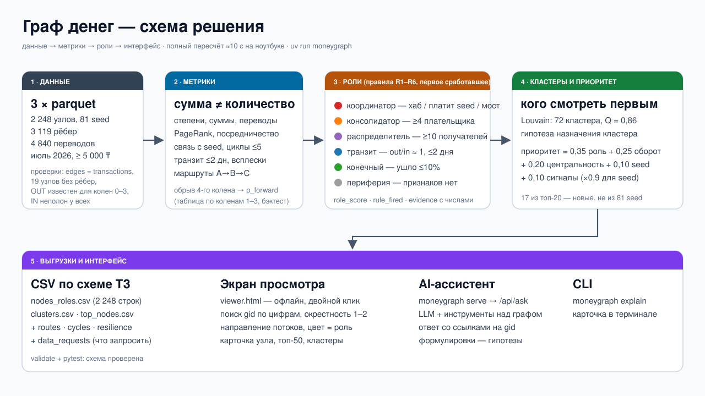
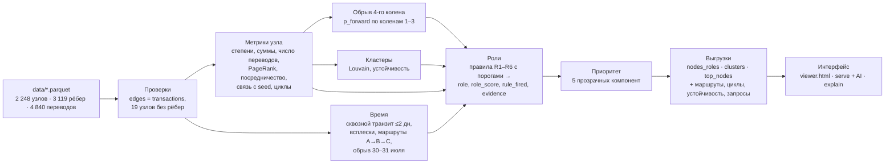

# Граф денег — HackAlem AI (команда A-lN)

Инструмент для AML-аналитика. Берёт выгрузку исходящих переводов 81 известного клиента на 4 колена
и за ~5 секунд отвечает на вопрос: **«кого из 2 248 клиентов смотреть первым и почему»**.

- Каждому узлу присваивается роль из словаря ТЗ: консолидатор, транзит, распределитель, конечный
  получатель, координатор, периферия. К роли прилагаются уверенность, сработавшее правило и
  обоснование с числами.
- Сеть разбивается на кластеры, у каждого кластера есть гипотеза о назначении.
- Узлы ранжируются по прозрачной формуле приоритета.
- Есть экран просмотра (схема потоков, поиск по gid, карточка узла) и AI-ассистент, который отвечает
  на вопросы по графу.

> Все выводы — **гипотезы для проверки** («признаки консолидации»), а не утверждения о виновности.

---

## Быстрый старт

Нужен только [uv](https://docs.astral.sh/uv/). Python 3.12 и зависимости uv поставит сам.

```bash
uv sync                      # один раз: окружение и зависимости
uv run moneygraph            # полный пересчёт: data/*.parquet → out/ (≈5 с)
```

После прогона:

| Команда | Что делает |
|---|---|
| открыть `out/viewer.html` | экран просмотра: работает офлайн, открывается двойным кликом |
| `uv run moneygraph serve` | тот же экран с AI-ассистентом на <http://127.0.0.1:8765> |
| `uv run moneygraph explain 8165763100` | карточка узла в терминале (полный gid или последние цифры) |
| `uv run pytest` | проверка выгрузок по схеме ТЗ |

Для AI-ассистента скопируйте `.env.example` в `.env` и впишите `OPENAI_API_KEY`. Если ключ выдан
через прокси, укажите ещё `OPENAI_BASE_URL`. Без ключа ассистент работает в резервном режиме: по gid
из вопроса показывает карточки узлов. Всё остальное от ключа не зависит.

Пути можно переопределить: `uv run moneygraph --data путь/к/parquet --out путь/к/выгрузкам`.

## Схема решения

Слайд: [`docs/solution_diagram.svg`](docs/solution_diagram.svg).





## Выгрузки (`out/`)

| Файл | Содержание |
|---|---|
| **`nodes_roles.csv`** | ровно 2 248 строк. Обязательные колонки ТЗ: `gid, role, role_score, cluster_id, priority_score, evidence`. Дополнительно: `rank, rule_fired, alt_role, sink_status, truncated, p_forward`, метрики и компоненты приоритета `prio_*` |
| **`clusters.csv`** | строка на кластер: `cluster_id, n_nodes, n_seed, sum_kzt_internal, top_gids, hypothesis`, а также состав ролей, потоки в кластер и из него, устойчивость, флаг изолированного фрагмента |
| **`top_nodes.csv`** | топ-50 по приоритету: `rank, gid, role, priority_score, why`, а также `is_seed`, `new_lead` (узел не из исходных 81) и `evidence` |
| `routes.csv` | устойчивые маршруты A→B→C: B пересылает C в течение 0–2 дней после поступления от A, в ≥2 разные даты |
| `cycles.csv` | возвратные потоки: простые циклы длиной ≤5 |
| `resilience.csv` | устойчивость сети при изъятии топ-N узлов по приоритету в сравнении с N случайными |
| `data_requests.csv` | оценка полноты: какие данные и по каким узлам запросить следующими |
| `p_forward_table.csv` | эмпирическая таблица для узлов, обрезанных 4-м коленом |
| `graph.json`, `viewer.html`, `metrics.json` | данные экрана (контракт в [`docs/graph_json.md`](docs/graph_json.md)), экран, сводные метрики прогона |

В CSV нет пустых значений: `-1` в `out_in_ratio` и `fast_share` означает «не применимо»,
`-` в `alt_role` и `flags` — «нет». Кодировка UTF-8 без BOM, gid хранятся как целые (int64).

## Как устроены данные и что мы с этим делаем

Мы проверили структуру обхода: ребро, найденное на колене k, всегда исходит из узла колена k−1.
Отсюда следуют выводы ниже; все они учтены в правилах и попадают в `evidence`.

1. **Исходящие известны полностью только для колен 0–3.** У 444 узлов 4-го колена исходящие просто
   не выгружались. Поэтому ни один из них не назван подтверждённым стоком
   (`sink_status = truncated_depth`), а роль ставится по эмпирической вероятности пересылки
   (см. «Обрыв 4-го колена»).
2. **Входящие неполны у всех, а не только у seed.** Видны лишь плательщики внутри обхода, поэтому
   отношение «отдал / получил» завышено у всех узлов (у не-seed медиана 1,07, у 354 узлов отдано
   больше полученного). Мы не называем такие узлы аномалией. В обосновании пишем «отправил в 4,2×
   больше полученного → есть невидимые входящие», а узел попадает в `data_requests.csv`. У seed
   входящий баланс не участвует ни в одном решении.
3. **Сумма и число переводов — разные сигналы.** Каждое правило и каждое обоснование используют и
   число контрагентов, и число переводов, и сумму, и средний перевод.
4. **Граф направленный.** Роли, посредничество (по числу шагов: networkx трактует вес как длину, так
   что сумма в качестве веса не годится) и PageRank считаются на направленном графе. Единственное
   исключение — кластеризация Louvain: она работает на **неориентированной** проекции, где вес пары
   равен сумме переводов в обе стороны.
5. **Обрыв по времени.** Деньги, пришедшие 30–31 июля, могли уйти дальше в августе. У таких
   «конечных получателей» уверенность умножается на 0,6 (`sink_status = truncated_time`).
6. **Порог 5 000 ₸.** Дробление ниже порога не видно. Поэтому за сигнал дробления мы не берём суммы
   5–10 тыс., которые обильны из-за самого порога, а берём повторяющиеся одинаковые круглые суммы от
   разных плательщиков.
7. **19 seed без единого ребра** попадают в кластер 0 с ролью «периферия» и `sink_status = no_data`.
   Для них формируется запрос на наличные и межбанковские операции.

## Роли: формальные правила

Правила проверяются **сверху вниз, срабатывает первое**. Пороги собраны в
[`src/moneygraph/config.py`](src/moneygraph/config.py). `rule_fired` показывает, какое правило
сработало и с какими числами, `alt_role` — другую роль, признаки которой тоже есть.

| # | Роль | Правило (порог) | Доля узлов на пороге | Узлов |
|---|---|---|---|---|
| R1 | **координатор** | хаб: получает от ≥8 **и** отправляет ≥20 разным клиентам; **или** платит ≥3 разным seed; **или** мост: посредничество в топ-1% и соседи в ≥4 кластерах с seed | in≥8 — 0,8%, out≥20 — 1,2% | 17 |
| R2 | **распределитель** | ≥10 получателей и получателей ≥3× больше, чем плательщиков | out≥10 — 2,8% | 44 |
| R3 | **консолидатор** | ≥4 разных плательщика **или** ≥2 seed среди плательщиков; если одновременно выполнен R2, побеждает бо́льшее из in/4 и out/10 | in≥4 — 4,0% | 85 |
| R4 | **транзит** | есть и вход, и выход, и `out/in ≥ 0,5` или ≥80% входящих ушло дальше за ≤2 дня. Максимальная уверенность при out/in ∈ [0,8; 1,2] (ровно **72** узла, как в ТЗ); выше 1,2 уверенность снижается («невидимые входящие»). Seed: входящие вне выгрузки, уверенность ≤0,6 | — | 419 |
| R5 | **конечный получатель** | исходящие известны (колено ≤3), дальше ушло ≤10%, получено ≥30 тыс ₸ **или** ≥2 перевода. ×0,6, если основное пришло 30–31 июля | — | 978 |
| T4 | 4-е колено | ≥4 плательщиков → консолидатор (правило опирается только на входящие). Иначе, если получено ≥30 тыс ₸ или ≥2 перевода: `p_forward < 0,5` → конечный получатель с уверенностью 1−p, иначе транзит с уверенностью min(p; 0,6) | — | (в R3/R5/R4) |
| R6 | **периферия** | остальное: разовый перевод <30 тыс ₸, смешанный профиль (дальше ушло 10–50%), seed без данных | — | 705 |

**`role_score`** (0–1): для R1–R5 это 0,5 на пороге и растёт линейно до 1,0 при многократном
превышении (например, консолидатор: от 4 плательщиков — 0,5, от 15 и больше — 1,0). Для 4-го
колена — эмпирическая вероятность. Для периферии — 1 минус перцентиль активности: чем меньше
оборот, тем увереннее «роли нет».

Порог 30 тыс ₸ близок к медиане отдельного перевода (30 тыс.) и ниже медианы суммы по ребру
(45 тыс.). Отсекает разовые мелкие поступления.

## Обрыв 4-го колена: оценка `p_forward`

На 1 723 не-seed узлах колен 1–3, у которых исходящие известны, мы посчитали, какая доля пересылает
деньги дальше, в зависимости от профиля входящих. Эту долю (со сглаживанием к общей доле 37%)
переносим на 444 обрезанных узла ([`p_forward_table.csv`](out/p_forward_table.csv)):

| плательщиков \ переводов | 1 | 2–4 | 5+ |
|---|---|---|---|
| 1 | 26% (n=1 126) | 40% (156) | 57% (30) |
| 2 | — | 50% (195) | 83% (33) |
| 3–4 | — | 62% (83) | 78% (55) |
| 5+ | — | — | 74% (45) |

Проверка честности: доля пересылающих по коленам стабильна (35% / 42% / 36%). Бэктест «таблица по
коленам 1–2 → прогноз для колена 3» даёт **AUC 0,58**, то есть сигнал слабый. Поэтому уверенность у
узлов 4-го колена умеренная, а их роль сопровождается запросом выписки (`data_requests.csv`).

## Приоритет (`priority_score`, 0–1)

```
priority = 0,35·(вес роли × role_score) + 0,25·перцентиль оборота + 0,20·перцентиль центральности
         + 0,10·связь с seed + 0,10·сигналы;   ×0,9 для seed (уже известны правоохранителям)
```

- Вес роли: координатор 1, консолидатор 0,9, распределитель 0,8, транзит 0,6, конечный получатель
  0,5, периферия 0,1.
- Центральность — максимум из перцентилей PageRank (по суммам) и посредничества.
- Связь с seed = min(1; число seed среди контрагентов / 3).
- Сигналы = min(1; число временных и аномальных флагов / 3). Флаги: сквозной транзит, синхронные
  поступления, веерная рассылка за день, цикл, устойчивый маршрут, повторяющиеся суммы, аномалия
  относительно своего колена.

Каждая компонента лежит в `nodes_roles.csv` (`prio_*`), в карточке узла и в тексте `why`.
**17 из топ-20 — новые узлы, не входящие в исходные 81.** Устойчивость к весам: при изменении любого
веса на ±20% топ-20 совпадает с исходным минимум на 85% (в среднем на 93%).

## Кластеры

Louvain на неориентированной проекции (вес — сумма переводов), `seed=42`. Получилось 72 кластера,
модулярность 0,86. **9 кластеров содержат больше одного seed** (в примечании ТЗ — 8 устойчивых).

`stability` — средний лучший Jaccard кластера по 10 прогонам Louvain с разными seed. Гипотеза
собирается из шаблонов по составу ролей: «признаки управляющего ядра», «признаки консолидации
(k seed → …)», «веерная раздача», «транзитная цепочка», «периферия», «изолированный фрагмент».

## Дополнительные баллы

- **Обрыв графа** — см. выше: `truncated`, `p_forward`, `sink_status`, бэктест.
- **Временные паттерны** — сквозной транзит (FIFO-сопоставление входящих и исходящих за ≤2 дня: 156
  узлов пересылают ≥80% быстро), синхронные поступления в один день, веерная рассылка за день, обрыв
  30–31 июля.
- **Маршруты и циклы** — 478 устойчивых маршрутов A→B→C (`routes.csv`) и 468 циклов длиной ≤5
  (`cycles.csv`).
- **Аномалии** — робастный z-score оборота и числа переводов относительно узлов того же колена;
  повторяющиеся одинаковые суммы.
- **Устойчивость сети** (`resilience.csv`):

  | изъято | крупнейшая компонента: топ / случайные | оборот, достижимый от seed: топ / случайные |
  |---|---|---|
  | 10 | 90% / 99% | 84% / 99% |
  | 20 | 79% / 99% | 67% / 98% |
  | 50 | 57% / 96% | 26% / 95% |

  Изъятие 50 приоритетных узлов отрезает от seed 74% оборота, изъятие 50 случайных — 5%.
- **AI-ассистент** (`moneygraph serve`) — вопрос на естественном языке, например «кто собирает
  деньги с этих пятерых?». LLM (OpenAI, function calling) вызывает инструменты над готовыми
  выгрузками: `get_node`, `neighbors`, `top_nodes`, `cluster_summary`, `find_paths`,
  `search_nodes`, `common_counterparties`, `overview`. Ответ ссылается на gid (они кликабельны на
  экране) и сформулирован как гипотеза. Показывается трасса вызовов. Провайдер спрятан за
  интерфейсом `LLMProvider`, так что Claude можно подключить без переделки инструментов.
- **Карточка узла** — `uv run moneygraph explain <gid>` и правая панель экрана: роль, правило,
  обоснование, разложение приоритета, кластер и гипотеза, контрагенты с датами.
- **Оценка полноты** (`data_requests.csv`, 380 запросов):
  - входящие из-за пределов выборки — 219;
  - операции за август — 81;
  - выписки исходящих по 4-му колену — 61;
  - наличные и межбанковские операции по seed без данных — 19.

## Экран просмотра

`out/viewer.html` — самодостаточная страница: vis-network и данные встроены, интернет не нужен.

- Поиск по gid: полный номер или любые цифры. Все gid заканчиваются на `…100`, поэтому вводите
  8–10 последних цифр.
- По умолчанию показывается окрестность выбранного узла на 1–2 шага. Входящие и исходящие рёбра
  разного цвета, толщина — по сумме.
- Режим «весь граф» строится по предрасчитанной раскладке «кластер в кластере».
- Цвет узла — роль, seed отмечены отдельной формой, узлы 4-го колена — пунктирной рамкой.
- Карточка узла, кликабельные топ-50 и список кластеров. При запуске через `serve` появляется панель
  AI-ассистента.

## Демо-сценарий (5 минут)

1. `uv run moneygraph` — живой пересчёт за ~5 с, проверка схемы ТЗ проходит.
2. Экран, топ-1 **…8165763100 — консолидатор**: получает от 15 плательщиков 1,17 млн ₸ (26
   переводов), 4 плательщика за один день 12.07, дальше уходит почти всё (109% полученного, то есть
   есть невидимые входящие). Кластер 5 с 3 seed.
3. **…8603629100 — координатор (хаб)**: собирает от 19 плательщиков (1,82 млн ₸) и раздаёт 61
   получателю (4,99 млн ₸).
4. **…5075949100 — 4-е колено**: исходящие не выгружены. Получил 2,23 млн ₸ за 7 переводов, у
   похожих узлов колен 1–3 дальше пересылают 57% → «транзит (оценка)» с уверенностью 0,57. Узел
   попадает в запрос выписки. Так показываем, как решена ловушка обрыва.
5. AI-ассистент: «кто собирает деньги от seed …?» → ответ со ссылками на узлы.
6. `data_requests.csv` — что запросить дальше.

## Ограничения

- Видны только внутрибанковские переводы ≥5 000 ₸ за июль 2026. Наличные, другие банки, дробление
  ниже порога и август не видны.
- Входящие неполны у всех узлов, исходящие обрезаны на 4-м колене. `p_forward` — слабый сигнал
  (AUC 0,58).
- Пороги и веса заданы экспертно (их проверку на чувствительность см. выше). Размеченных ролей
  (ground truth) нет, поэтому качество оценивается обоснованностью, а не точностью.
- Louvain игнорирует направление потоков и может давать другие разбиения при другом `seed`; для
  этого считается `stability`.
- Нет атрибутов клиентов: выводы опираются только на структуру и суммы и остаются гипотезами.

## Масштабирование до ~1 млн узлов

- **Хранение и признаки.** Parquet → DuckDB или Polars. Степени, суммы и временные признаки
  считаются колоночными group-by за секунды. FIFO-транзит — оконными функциями по (узел, дата).
- **Графовые алгоритмы.** networkx → igraph, graph-tool или cuGraph (на CPU достаточно igraph).
  Точное посредничество O(VE) заменить на приближённое по выборке k источников. Louvain заменить на
  Leiden (igraph/leidenalg). Циклы искать с ограничением длины внутри слабосвязных компонент.
  Компоненты обрабатывать параллельно.
- **Инкрементальность.** Новая выгрузка пересчитывает только затронутые компоненты. Пороги
  перекалибруются по перцентилям, а не по абсолютным числам.
- **Интерфейс.** Весь граф в браузере не рисуется: сервер отдаёт окрестность узла и агрегаты
  кластеров по API, а раскладка кластеров считается заранее.
- **AI.** Инструменты ассистента обращаются к индексам (DuckDB), а не к JSON в памяти. В LLM уходит
  только найденный подграф.

## Структура репозитория

```
data/                  исходные parquet + README датасета
src/moneygraph/
  config.py            все пороги и веса
  load.py              загрузка, проверки, граф (порт стартового кода)
  features.py          структурные признаки, p_forward + бэктест, аномалии
  temporal.py          сквозной транзит, всплески, обрыв по времени, маршруты
  clusters.py          Louvain, устойчивость, гипотезы, раскладка
  roles.py             правила ролей, role_score, evidence
  priority.py          флаги, приоритет, чувствительность, why
  extras.py            циклы, устойчивость сети, запросы данных
  export.py            CSV + graph.json
  validate.py          механическая проверка схемы ТЗ
  viewer.py, web/      экран просмотра (vis-network встроен)
  cards.py             карточка узла, поиск по суффиксу
  assistant/           LLM-провайдер, инструменты, агентный цикл
  serve.py             локальный сервер: экран + /api/ask
  cli.py               moneygraph [run | explain | serve]
out/                   выгрузки (закоммичены)
tests/                 pytest: схема, обрыв 4-го колена, отсутствие захардкоженных gid
docs/graph_json.md     контракт данных экрана
```
