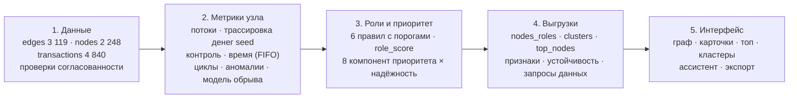

# Граф денег — восстановление финансовой структуры группы по транзакционной сети

Кейс HackAlem AI. Аналитику известны 81 клиент нижнего уровня (seed). Инструмент строит направленный
граф их исходящих переводов на 4 колена (2 248 узлов), присваивает **каждому узлу роль с числовым
обоснованием**, разбивает сеть на кластеры и ранжирует узлы. Главный вопрос: **«кого из 2 248 клиентов
смотреть первым и почему»**.

> Все выводы — **гипотезы для проверки** («признаки консолидации»), а не утверждения о виновности.
> Данные обезличены; никакие атрибуты клиентов не используются и не достраиваются.

## Запуск в один клик (для жюри)

Нужен только [Docker Desktop](https://www.docker.com/products/docker-desktop/) (на Linux — Docker Engine с плагином
Compose). Дважды щёлкните файл для своей системы:

| Система | Файл |
|---|---|
| Windows | `start-windows.bat` |
| macOS | `start-macos.command` |
| Linux | `start-linux.sh` (или `./start-linux.sh` в терминале) |

Скрипт запускает Docker, если он установлен, но выключен, собирает и поднимает приложение, ждёт окончания анализа
**данных кейса** (2 248 клиентов, 4 840 переводов за июль 2026) и сохраняет выгрузки в папку `results/`. Затем он
открывает в браузере рабочее пространство с результатом. Первый запуск занимает несколько минут: скачиваются образы
и зависимости. Следующие запуски занимают секунды. Чтобы остановить приложение, нажмите Enter в окне скрипта.
Подробности и решение проблем — в [LAUNCH.md](LAUNCH.md); как всё устроено — в [HOW_IT_WORKS.md](HOW_IT_WORKS.md).

Расчёт занимает ≈7 секунд (лимит ТЗ — 5 минут) и детерминирован: повторный прогон даёт побайтно одинаковые CSV.
Перед записью выгрузок движок сам проверяет схему: 2 248 уникальных gid, все поля заполнены, скоры в [0, 1],
evidence не длиннее 200 символов и содержит числа.

## Схема решения



## Что на выходе

Файлы лежат в `results/` после запуска в один клик; их же можно скачать в интерфейсе кнопкой «↓ Экспорт».

| Файл | Содержание |
|---|---|
| `nodes_roles.csv` | **2 248 строк**: `gid, role, role_score, cluster_id, priority_score, evidence` + `flags, depth, is_seed, priority_rank` |
| `clusters.csv` | строка на кластер: `cluster_id, n_nodes, n_seed, sum_kzt_internal, top_gids, hypothesis` + состав ролей |
| `top_nodes.csv` | **топ-50**: `rank, gid, role, priority_score, why` + evidence, flags |
| `features.csv` | все признаки узла, истинность каждого правила (`rule_*`), компоненты приоритета (`p_*`) — чтобы проверить любой gid |
| `resilience.csv` | устойчивость сети при блокировке топ-N по сравнению со случайными N узлами |
| `data_requests.csv` | оценка полноты: какие данные запросить следующими и по каким gid |
| `run_report.md` | сводка прогона: роли, качество модели обрыва, флаги, устойчивость, кластеры с seed |

## Как это работает

### 1. Устройство выгрузки — ключ к правильным ролям
Обход шёл **от** seed по исходящим переводам на 4 колена. Отсюда три следствия, на которые опираются правила:
- **Колена 0–3 раскрыты**: их исходящие собраны полностью. Если у такого узла нет исходящих, деньги
  действительно остались (в пределах банка, ≥ 5 000 ₸, июль).
- **Колено 4 не раскрыто**: у 444 узлов исходящих нет в данных, а не в жизни. Им **никогда** не
  присваивается `terminal`.
- **Вход seed занижен**: деньги, пришедшие к seed извне, в выгрузку не попали. Поэтому для seed отношение
  «отдал/получил» не используется.

### 2. Признаки узла (`features.csv`)
| Признак | Что измеряет |
|---|---|
| `in_deg`, `out_deg`, `in_kzt`, `out_kzt`, `in_tx`, `out_tx` | разные плательщики и получатели, суммы, число операций (сумма и частота — разные сигналы) |
| `pass_ratio` | отдал / получил; публикуется только для не-seed колен 1–3 с видимым входом (у seed вход занижен, у 4-го колена выход неизвестен) |
| `traced_in_kzt`, `seed_sources` | **хронологическая пропорциональная трассировка (haircut по датам)**: переводы обрабатываются в порядке дат (внутри дня — по колену обхода). У каждого узла есть видимый остаток и «пул» денег с метками seed; перевод уносит долю пула, пропорциональную своей доле в остатке. Если узел отправляет больше видимого остатка, разница — внешние деньги без метки. Итог: сколько ₸ входа **по датам могло прийти** от seed и от скольких разных seed (≥ 5 000 ₸ от каждого). Это оценка связи средств, а не доказанный путь конкретных денег |
| `control_nodes`, `control_kzt` | **дерево доминаторов** от виртуального корня над всеми seed: сколько узлов (и какой их вход) перестанут быть достижимы от seed при блокировке узла |
| `betweenness_pct`, `partner_clusters` | посредничество внутри своей компоненты (длина ребра = 1/сумма); из скольких кластеров контрагенты |
| `fast_2d_share`, `strict_fast_2d_share` | FIFO-сопоставление входящих и исходящих по датам: доля суммы, ушедшей в течение 0–2 дней, и строго через 1–2 дня |
| `sync_max_payers`, `peak_day_tx`, `split_days`, `small_share` | синхронные поступления в один день, всплеск, дробление (≥ 3 перевода одному контрагенту за день), повтор сумм 5–10 тыс ₸ |
| `repeated_routes`, `dated_returns` | маршрут A→узел→C на ≥ 2 разных датах; циклы из 2–3 звеньев, замкнувшиеся по датам за ≤ 7 дней |
| `hop_z` | робастный z-score (медиана/MAD/IQR в log-шкале) относительно узлов своего колена |
| `p_continue` | для 4-го колена: оценка того, что узел отправляет деньги дальше, по аналогии с раскрытыми коленами (см. ниже) |
| `followup_days` | сколько дней наблюдали узел после последнего поступления |

### 3. Правила ролей
Правила проверяются **по порядку**; роль задаёт первое сработавшее. Все пороги лежат в `app/backend/src/moneygraph/config.py`.
Истинность каждого правила выгружена в `features.csv` (`rule_coordinator` … `rule_terminal`).

| # | Роль | Правило (пороги) | role_score (0–1) |
|---|---|---|---|
| 1 | `coordinator`: кандидат в организаторы | колено ≤ 3 **и** (≥ 5 плательщиков **и** ≥ 10 получателей — и собирает, и распределяет; **или** ≥ 3 плательщика, деньги ≥ 3 разных seed, выплаты обратно seed и ≥ 2 получателя) **и** признак связующего звена: деньги ≥ 2 seed, или посредничество ≥ P90 компоненты, или контрагенты из ≥ 3 кластеров | 0.5 + 0.5·mean(плательщики/15, получатели/40, seed/4, посредничество) |
| 2 | `consolidator`: точка консолидации | (≥ 5 разных плательщиков **или** ≥ 3 плательщика, через которых сходятся деньги ≥ 3 разных seed) **и** деньги накапливаются: получателей ≤ max(2, плательщики/3) **или** отдал ≤ 80 % полученного; узел не веер. Сбор без накопления — периферия с флагом `collector` | 0.5 + 0.5·mean(плательщики/15, seed/4, 1 − получатели/плательщики, доля входа, связанная с seed) |
| 3 | `distributor`: распределитель | ≥ 10 получателей **и** получателей ≥ 2× больше, чем плательщиков | 0.5 + 0.5·mean(получатели/50, 1 − плательщики/получатели, 1 − доля крупнейшего получателя) |
| 4 | `transit`: транзит | не seed, колено ≤ 3; отдал **50–150 %** полученного **и** пересылка подтверждена по датам (FIFO): ≥ 50 % суммы ушло за 0–2 дня после поступлений и ≥ 25 % — строго через 1–2 дня. Баланс «как у транзита» без подтверждения по датам — периферия | 0.4 + 0.6·mean(1 − \|log₂ отношения\|, доля за 0–2 дня, 2 × доля строго за 1–2 дня, вход/300 тыс) |
| 5 | `terminal`: конечный получатель | колено ≤ 3 (исходящие полны), есть вход, отдал дальше **≤ 20 %**, после последнего поступления наблюдали **≥ 7 дней** | 0.4 + 0.6·mean(удержано, вход/500 тыс, плательщики/3, дни наблюдения/30) |
| 6 | `peripheral`: периферия | остальное: 4-е колено (обрыв), seed без видимого входа, поступления в последние дни июля, баланс транзита без подтверждения датами, сбор без накопления, частичное удержание, seed без переводов | по подтипу: обрыв = 1 − `p_continue`; прочие 0.5–0.9 |

`role_score` — сила поддержки правила данными, а не вероятность вины. Каждое слагаемое в формулах
ограничено отрезком [0, 1].

### 4. Приоритет — «кого смотреть первым»
`priority_score = Σ wᵢ · компонентаᵢ × надёжность`, где каждая компонента лежит в [0, 1]:

| Компонента | Вес | Формула |
|---|---|---|
| деньги seed | 0.15 | log(1 + вход, связанный с seed/5 000) / log(1 + max); у seed — не меньше 0.7 × то же по оттоку |
| сходимость | 0.15 | число разных seed, чьи деньги дошли до узла / 4 |
| контроль | 0.15 | log(1 + control_nodes) / log(1 + max) |
| сбор | 0.10 | плательщики / 10 |
| оборот | 0.10 | log(1 + (вход + выход)/5 000) / P99 |
| посредничество | 0.10 | betweenness / P95 положительных |
| роль | 0.15 | вес роли (координатор, консолидатор 1.0; распределитель 0.8; транзит 0.7; конечный 0.35; периферия 0.1) × (0.5 + 0.5·role_score) |
| флаги | 0.10 | число красных флагов / 3 |

Надёжность: seed × 0.85 (они уже известны, фокус смещается на новых участников), 4-е колено × 0.75,
узел без переводов × 0. В `top_nodes.csv` поле `why` называет **три компоненты с наибольшим вкладом**,
ключевые числа и следующий шаг проверки.

### 5. Кластеры
Louvain на **ненаправленной** проекции (встречные суммы складываются), `seed=42`. Направление теряется
только на этом шаге, роли и приоритет считаются на направленном графе. Кластер 0 — 19 seed без единого
перевода. Гипотеза назначения кластера строится правилом по его составу: «контур сбора» (≥ 2 seed и есть
консолидатор/координатор), «контур распределения» (веер ≥ 20), «ветка одного seed», «окружение без seed»,
плюс пометка «нужна дозагрузка», если ≥ 30 % узлов кластера в обрыве.

## Учёт ограничений данных

| Ограничение из ТЗ | Как учтено |
|---|---|
| 444 узла 4-го колена без исходящих (обрыв обхода) | `terminal` запрещён. Логистическая регрессия обучена на 1 723 узлах колен 1–3, где исходящие известны. Цель: «после первого поступления отправил деньги дальше» (базовая доля 0.32). По профилю входящих модель даёт `p_continue`. Качество: AUC 0.75 на 5-кратной кросс-валидации; при переносе «обучение на коленах 1–2 → проверка на 3-м» AUC 0.66, и модель занижает долю (0.21 против 0.30). Поэтому `p_continue` — **оценка по аналогии для очерёдности дозагрузки, а не вероятность**. Флаг `likely_continues` при `p_continue ≥ 0.5`; узлы попадают в `data_requests.csv` |
| Только исходящие; вход seed занижен | `pass_ratio` не считается для seed; seed не бывает транзитом; в приоритете seed учитывается по собственному оттоку |
| 354 узла с видимым входом отдают больше, чем получили (377, если считать и узлы без входа) | трассировка списывает избыток как внешние деньги без метки; флаг `external_funds` (275 не-seed колен 1–3, отдали > 150 % входа) |
| Порог 5 000 ₸ | дробление ниже порога невидимо: ловим только видимое (`structuring`, `small_amounts`) и прямо пишем об этом |
| Конец периода (июль) | `terminal` только при ≥ 7 днях наблюдения после последнего поступления; иначе флаг `short_followup` и запрос за август |
| 19 seed без рёбер, 12 только получатели | кластер 0 и роль periphery с пояснением «нужны данные вне выгрузки»; seed-получатели могут быть `terminal`, потому что их исходящие раскрыты |
| 16 слабосвязных компонент со связями (+ 19 изолированных seed = 35) | посредничество считается внутри своей компоненты; Louvain не объединяет несвязанные узлы |
| Нет ground truth | вместо точности — проверяемость: у каждого узла есть `rule_*`, компоненты `p_*` и числовое evidence; плюс сравнение двух независимых реализаций (ниже) |

## Дополнительные функции (опциональная часть ТЗ)
- **Артефакт обрыва**: модель `p_continue` и список узлов на дозагрузку.
- **Временные паттерны**: сквозной транзит (FIFO 0–2 дня), синхронные поступления, всплески.
- **Маршруты и возвраты**: повторяющиеся цепочки A→B→C на разных датах; датированные циклы 2–3 звена.
- **Аномалии**: робастный z-score относительно колена, дробление, повтор малых сумм.
- **Устойчивость сети** (`resilience.csv`): блокировка топ-N узлов по приоритету против случайных N узлов:

  | N | достижимо от seed (топ) | оборот к ним (топ) | достижимо (случайные) | оборот (случайные) |
  |---|---|---|---|---|
  | 5 | 92 % | 87 % | 99.5 % | 99.5 % |
  | 10 | 87 % | 81 % | 99.2 % | 99.0 % |
  | 20 | 71 % | 68 % | 97.7 % | 97.9 % |
  | 50 | 59 % | 54 % | 95.9 % | 95.1 % |

  Блокировка 20 приоритетных узлов отрезает треть оборота; 20 случайных — 2 %. Приоритет выделяет
  узлы, на которых держится сеть.
- **Карточка узла**: автотекст в интерфейсе (роль, потоки, главные контрагенты, сигналы).
- **Оценка полноты** (`data_requests.csv`): исходящие для 72 узлов 4-го колена, август для 292 узлов,
  данные других банков и наличные для seed и узлов с внешними средствами.
- **Ассистент аналитика** (по умолчанию офлайн): «кто собирает деньги с A, B, C», «путь от A к B»,
  «откуда деньги у X», «куда ушли деньги X», «кластер X», «топ 10 консолидаторов». Отвечает прямо по графу
  со ссылками на узлы; LLM и интернет не нужны. LLM-режим (Claude) включается только явно.

## Интерфейс и сценарий демо
Граф рисуется на WebGL (sigma.js). Стрелки показывают направление денег, размер узла — приоритет, цвет — роль
или кластер; seed выделены.
1. **Топ-лист приоритетов** слева: у каждого клиента есть блок «Почему проверить». Рядом вкладка **кластеров**
   с гипотезами и **поиск по части gid** (от 3 цифр).
2. **Карточка клиента**: роль и скоры, основание гипотезы с числами, вклад компонент приоритета, сработавшие
   правила, плательщики и получатели, транзакции с датами. Кнопки «← Откуда деньги» и «Куда ушли →»
   показывают цепочки на графе; есть окружение узла и путь к другому клиенту.
3. **Фильтры** по ролям, кластеру, минимальному приоритету, «без периферии»; переключение графа в таблицу.
4. **Обзор**: сводка ролей, устойчивость сети, качество модели обрыва, запросы данных.
5. **Ассистент**: вопрос на русском, в ответе кликабельные gid и кнопка «Показать на графе».
6. **Загрузка своей выгрузки** (zip или три parquet) — новое исследование с той же аналитикой.

## Разбор узлов «за минуту»
**`100000003115284100` — consolidator, приоритет №1.** 8 разных плательщиков (2 из них seed), дальше ушло
только 24 % из 2,16 млн ₸ входа, и всё ушло двум получателям. Правило 2: ≥ 5 плательщиков, получателей
2 ≤ max(2, 8/3). По трассировке с учётом дат 815 тыс ₸ входа (38 %) связаны с **3 разными seed**.
До 7 плательщиков в один день. Похоже на точку сбора денег нескольких курьеров.

**`100000008603629100` — coordinator, №2.** Собирает от 19 плательщиков и рассылает 61 получателю
(правило 1: ≥ 5 и ≥ 10). По посредничеству входит в верхний 1 % своей компоненты, контрагенты из
8 кластеров, блокировка отрезает от seed 47 узлов с входом 3,27 млн ₸. Честная оговорка: с seed по датам
связано лишь 0,6 % его входа, а отдаёт он в 2,7 раза больше видимого входа. Высокий приоритет даёт
**структура**: узел — узкое место и мост сети. Следующий шаг — полная выписка и данные других банков,
чтобы отличить организатора от просто оживлённого счёта.

**`100000004135268100` — transit, №10.** Получил 1,24 млн ₸ от 2 плательщиков, отдал дальше 81 % трём
получателям. Правило 4: отношение в 50–150 % и подтверждение датами: 69 % суммы ушло за 0–2 дня, 30 % —
строго через 1–2 дня. 86 % входа по датам связано с seed; есть повторяющийся маршрут A→узел→C.

**`100000005075949100` — peripheral, 4-е колено.** Получил 2,23 млн ₸ от одного плательщика, но исходящие
не выгружались, поэтому узел не «конечный». Оценка дальнейших переводов 75 % (по аналогии с коленами 1–3,
см. ограничения модели). Узел попадает в `data_requests.csv` как кандидат на дозагрузку исходящих.

## Как мы работали: два независимых AI-агента
Решение собрали два агента: **Claude** (Claude Code) и **Codex** (GPT-6-Astra).
1. Общий контракт: сжатое ТЗ, схемы CSV и правила работы для обоих агентов.
2. **Фаза 1, независимо**: Claude и Codex написали по пайплайну, не видя кода друг друга.
3. **Сравнение**: роли совпали на 56 % (каппа 0.19), все
   28 консолидаторов Codex совпали с консолидаторами Claude, кластеры близки (ARI 0.81), из топ-40 совпали 21 узел. Расхождения
   показали хрупкие места: у Claude транзит определялся только балансом (0.5–1.5) без подтверждения датами, у Codex связь с seed считалась
   по достижимости путей, у Claude — по трассировке сумм.
4. **Согласование**: от Codex взяты окно наблюдения ≥ 7 дней для terminal, транзит
   с обязательным FIFO-подтверждением, условие накопления для консолидатора, посредничество, датированные
   циклы, робастные аномалии, множитель надёжности. От Claude — трассировка денег seed, дерево
   доминаторов, модель обрыва, оценка полноты, приоритет.
5. **Перекрёстное ревью**: Codex провёл состязательную проверку итогового кода (только чтение) и нашёл
   12 проблем. Главные: итеративная трассировка не сходилась и игнорировала даты; у 51 из 77 транзитных узлов
   не было подтверждения датами; были «консолидаторы», отдающие в 3–9 раз больше входа; модель обрыва
   обучалась на неточной цели; 92 текста evidence расходились с числами. Всё исправлено: трассировка
   переписана как однопроходная хронологическая, правила ужесточены, качество модели раскрыто честно.
   Итоговые роли совпадают с фазой-1 Codex на 95 % (каппа 0.91); приоритеты коррелируют с фазой-1 Claude
   на 0.82 (Спирмен); из топ-20 совпадают 14 узлов с Codex и 12 с Claude.
6. **Продукт** (`app/`): Claude — backend и движок, Codex — интерфейс. Отдельный экземпляр Codex независимо
   проверил backend (15 проблем, все исправлены и перепроверены), живой прогон всего стека — без ошибок.
   Журнал — в [`app/docs/COLLABORATION.md`](app/docs/COLLABORATION.md).

## Ограничения подхода
- Роли — гипотезы по структуре и суммам; назначения платежей, остатков и атрибутов клиентов в данных нет.
- Только внутрибанковские переводы ≥ 5 000 ₸ за июль: наличные, межбанк и дробление ниже порога невидимы.
- Даты без времени: порядок операций внутри дня условен (берём направление обхода). Поэтому трассировка
  seed и маршруты A→B→C — совместимость по датам и суммам, а не доказанное движение одних и тех же денег.
- Модель обрыва переносится с колен 1–3 на 4-е с потерей качества (AUC 0.75 → 0.66 при проверке переноса)
  и занижает долю продолжений; её выход — очерёдность дозагрузки, а не вероятность.
- Сильный структурный приоритет (мост, узкое место) может получить узел, мало связанный с деньгами seed
  (пример — №2). Компоненты `p_*` в `features.csv` показывают, за счёт чего получен приоритет.
- Пороги экспертные и не откалиброваны на размеченных данных (их нет). Все пороги собраны в
  `app/backend/src/moneygraph/config.py`, их чувствительность видна через `rule_*` и `p_*`.
- Louvain детерминирован при фиксированных версиях (`app/backend/pyproject.toml` / `uv.lock`); при других версиях
  networkx номера кластеров могут отличаться.

## Масштабирование до ~1 млн узлов
| Шаг | Сейчас (2 248 узлов) | При ~1 млн узлов / ~5 млн рёбер |
|---|---|---|
| Хранение и агрегаты | pandas в памяти | Parquet, партиционированный по дате; агрегаты в DuckDB/Polars (out-of-core); граф в igraph/graph-tool (C/C++) вместо networkx |
| Трассировка денег seed | один проход по 4 840 транзакциям с вектором из 81 метки на узел | тот же однопроходный алгоритм по транзакциям, отсортированным по дате (потоково, O(T·K)); при тысячах seed — разреженные метки / top-k на узел или группировка seed по делу |
| Дерево доминаторов | networkx | Lengauer–Tarjan почти линеен (O(E·α)), `igraph.dominator()`, метод не меняется |
| Посредничество | выборка 128 источников в компоненте | та же выборочная оценка (k ≈ 500–1000) параллельно по компонентам |
| Циклы и маршруты | все циклы 2–3 звена | только внутри кандидатов с высоким приоритетом; временные мотивы A→B→C — self-join по окну дат в SQL |
| Временные признаки (FIFO) | цикл Python по узлам | оконные функции SQL/Polars по партициям узлов, инкрементально по дням |
| Кластеризация | Louvain | Leiden (`leidenalg`), иерархия кластеров |
| Модель обрыва | логрег на 1 723 узлах | та же модель, признаки в SQL; обход расширяется адаптивно, только от узлов с высоким `p_continue` |
| Интерфейс | граф до 5 000 узлов по приоритету, окружение узла по запросу | кластеры как супер-узлы + эго-сеть выбранного узла (≤ 2 колена) с сервера по запросу; индекс поиска по gid |
| Пересчёт | ≈8 с | ночной батч + инкремент по дням; роли пересчитываются только в затронутых компонентах |

Правила ролей и формула приоритета не меняются: все признаки локальные или почти линейные по числу рёбер.

## Структура репозитория
```
start-windows.bat, start-macos.command, start-linux.sh   запуск в один клик
scripts/                логика запуска (start.ps1 для Windows, start.sh для macOS и Linux)
app/                    веб-продукт (docker compose)
  backend/              Python 3.12, FastAPI, uv
    src/moneygraph/     движок анализа
      config.py         все пороги и веса
      data.py           проверка входных данных
      features/         признаки: потоки, трассировка, контроль, время, циклы, аномалии, модель обрыва
      roles.py          правила ролей, role_score, evidence, флаги
      priority.py       приоритет и обоснование «why»
      clusters.py       Louvain и гипотезы кластеров
      resilience.py     устойчивость сети
      report.py         правила текстом, запросы данных, отчёт
      exports.py        выгрузки CSV и проверка их схемы
    src/mg_api/         HTTP API: прогоны, аналитика, ассистент, выгрузки
    sample_data/        данные кейса (edges, nodes, transactions)
    tests/              тесты движка и API
  frontend/             React + TypeScript + Vite, граф на sigma.js
  docs/                 архитектура, контракт API, журнал совместной работы
HOW_IT_WORKS.md         как всё работает
LAUNCH.md               запуск и решение проблем
```
